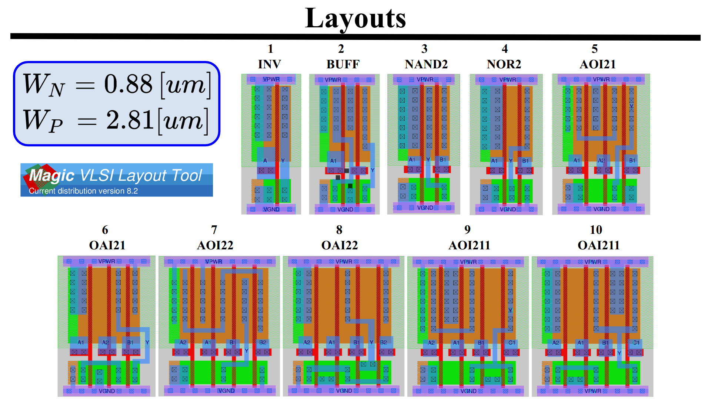
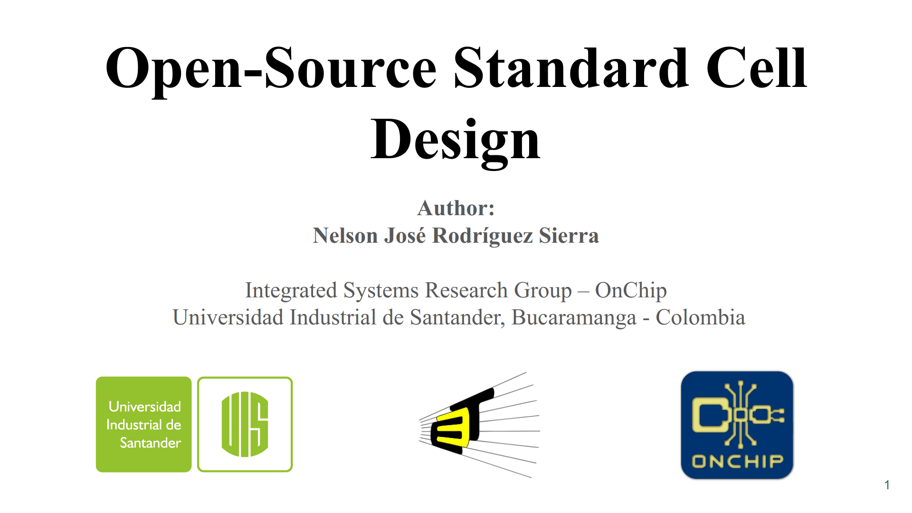

# Open-Source Standard Cell Design Methodology 

A 12-track height standard cell library built in [SKY130 PDK](https://skywater-pdk.readthedocs.io/en/main/). It is made up of 12 combinational cells, which were designed using [Magic VLSI Layout Tool](https://github.com/RTimothyEdwards/magic) and characterized using [Digital Standard Cell Characterizer (DSCC)](https://github.com/nelzeg/stdcell-characterizer). 

> The detailed documentation of this library can be read in ***[Open-Source Standard Cell and I/O Cell Design](./open-source_standard_cell_and_IO_cell_design.pdf)***

## The Library

It is made up of the following 12 combinational cells:

1. [INV](./01-inv/)
2. [BUFF](./02-buff/)
3. [NAND2](./03-nand2/)
4. [NOR2](./04-nor2/)
5. [AOI21](./06-oai21/)
6. [OAI21](./06-oai21/)
7. [AOI22](./07-aoi22/)
8. [OAI22](./08-oai22/)
9. [AOI211](./09-aoi211/)
10. [OAI211](./10-oai211/)

Where each cell consists of the following views (files): 
- Layout (`.mag`)
- LEF (`.lef`)
- Extracted Spice model (`.spice`)
- LIB (`.lib`)
- Timing data (`.txt`)

---

 

<b >👇🏼 Click on the image to watch the slides</b>

 

## Design Files

It was developed a set of scripts during both the design process and the cell characterization:  
1. [DSCC](./scripts/dscc/) : Digital Standard Cell Characterization tool.
2. [Fo4](./scripts/fo4/) : Data and post-processing script for the Fo4 testbench.
3. [Grid Template](./scripts/grid-template/) : Script to create custom height grids for layout implementation.
4. [Inverter Chain](./scripts/inverter-chain/) : Data and post-processing scripts for the inverter chain testbench.
5. [Results](./scripts/results/) : Testbench for timing measurements of the inverter designed with the optimal widths obtained.    
